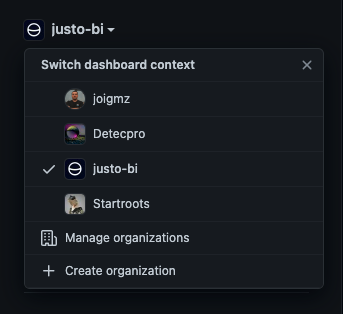
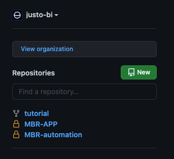

# tutorial

## Instalando GIT
Para poder utilizar git tiene que estar instalado en nuestro computador, para verificar si esta instalado podemos utilizar el comando:

```
git --version
```

Es posible que no tengamos la versión más reciente, por lo tanto, utilizaremos el instalador BREW para actualizarlo.   
Para verificar si tenemos BREW en nuestro Mac podemos utilizar el comando:

```
brew --version
```

Si no lo tienes, debes instalarlo con el siguiente comando:

```
/bin/bash -c "$(curl -fsSL https://raw.githubusercontent.com/Homebrew/install/HEAD/install.sh)"
```

Finalmente para actualizar tu versión de git tienes que utilizar el siguiente comando:

```
brew install git
```

## Comandos importantes para el terminal

* Ver archivos y carpetas en la ubicación actual

```
ls
```

* Desplazarnos hacia adelante entre carpetas

```
cd "[Nombre carpeta]"
```

Ejemplo 1:

```
cd Desktop
```

Ejemplo 2:

```
cd Desktop/tutorial
```

* Comando para desplazarnos hacia atrás entre carpetas
```
cd ..
```

## Guía resumen GitHub

Ejemplo de como utilizar git y github.

1. Crear repositorio  
El repositorio se creara en la organización o usuario que este seleccionado.  
  
Para crear repo hay que hacer click en new  
  

2. Clonar repositorio  
Luego de crear el repo debemos copiar el link y clonar en nuestro computador  
  

```
git clone "[link]"
```

* Ejemplo:

```
git clone https://github.com/joigmz/tutorial.git
```

3. Agregar cambios, crear comentario y subir a GitHub
* Agregar cambios
```
git add .
```
* Agregar comentario
```
git commit -m "[mensaje descriptivo]"
```
* Subir código a GitHub 🚀  
```
git push
```

4. Actualizar código alojado en nuestro Mac
```
git pull
```
Finalmente dejo un guía con los comandos más usados [Guía](github-git-cheat-sheet.pdf).